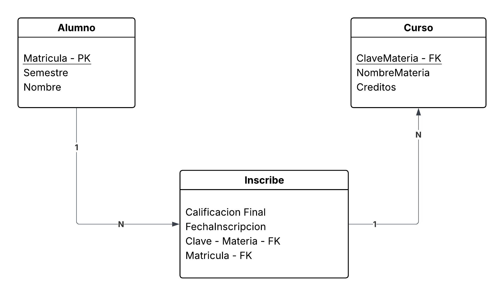

# Diccionario de Datos de base de datos control escolar

1. Información General

| Elemento | Valor |
| :--- | :--- |
| Proyecto | Sistema de Control Escolar |
| Versión | 1.0 |
| Fecha | Junio 2026 |
| Elaboró | Ing. José Luis Herrera Gallardo, MTI |
| SGBD | SQLServer |

2. Descripción del Sistema de Base de Datos

El sistena administra:

- Carreras
- Alumnos 
- Profesores
- Materias
- Grupos
- Inscripciones

Permite controla la oferta educativa y la inscripción de los estudiantes

3. Catálogo de Restricciones Utilizadas

| Código | Significado |
| :--- | :--- |
| PK | Primary Key |
| FK | Foreign Key |
| NN | Not Null |
| UQ | Unique |
| AI | Auto Increment |
| CK | Check |
| DF | Default |

4. Diccionario de Datos

**Tabla:** Carrera

**Descripción:** _Almacena las carreras ofertadas por la Universidad_

| Campo | Tipo | Longitud | Restricciones | Descripción |
| :--- | :--- | :--- | :--- | :--- |
| id_carrera | INT | - | PK, AI, NN | Identificador único de la carrera |
| nombre | VARCHAR | 100 | UQ, NN | Nombre de la carrera |
| duracion_cuatrimestre | INT | - | NN, CK(>0) | Duración del cuatrimestre |

---

**Tabla:** Alumno

**Descripción:** _Almacena la información de los estudiantes_

| Campo | Tipo | Longitud | Restricciones | Descripción |
| :--- | :--- | :--- | :--- | :--- |
| id_alumno | INT | - | PK, AI, NN | Identificador único del alumno|
| matricula | VARCHAR | 10 | UQ, NN| Matricula Institucional|
| nombre | VARCHAR | 50 | NN | Nombre del estudiante|
| apellido_paterno | VARCHAR | 50 | NN | Apellido Paterno |
| apellido_materno | VARCHAR | 50 | NULL | Apellido materno |
| correo | VARCHAR | 100 | UQ, NN | Correo Institucional |
| fecha_nacimiento | DATE | - | NN |Fecha de Nacimiento |
| id_carrera | INT | - | FK,NN | Carrera a la que pertenece|

5. Relaciones 

| Relación  | Cardinalidad |Descripción |
|:----------|:---------:|----------:|
| Carrera -> Alumno   | 1:N    | Una carrera tiene muchos Alumnos    |
| Carrera -> Materia    | 1:N   | Una Carrera tiene muchas materias    |
| Profesor -> Grupo    | 1:N    | Un profesor puede impartir a varios grupos    |
| Materia -> Grupo    | 1:N    |  Una materia puede abrirse en varios grupos    |
| Alumno -> Inscripcion    | 1:N    |  Un alumno puede tener varias inscripciones    |
| Grupo -> Inscripcion    | 1:N    |  Un grupo puede tener muchos alumnos    |

6. Matriz de Claves Foráneas

| Tabla  | Campo FK |Referencia |
|:----------|:---------:|----------:|
| Alumno   | id_carrera    | Carrera (id_carrera)    |
| Materia   | id_carrera    | Carrera (id_carrera)    |
| Grupo   | id_profesor    | Profesor (id_profesor)    |
| Grupo   | id_materia   | Materia (id_materia)    |
| Inscripcion   | id_alumno   | Alumno (id_alumno)    |
| Inscripcion   | id_grupo   | Grupo (id_grupo)    |

7. Integridad Referencial

| Regla | Descripción |
| :--- | :--- |
| IR-01 | No se puede registrar un alumno con una carrera inexistente |
| IR-02 | No se puede crear un grupo para una materia inexistente |
| IR-03 | No se puede crear un grupo para un profesor inexistente |

8. Reglas del Negocio

| Código | Regla |
| :--- | :--- |
| RN-01 | Un alumno pertenece solo a una sola carrera |
| RN-02 | Una carrera puede tener muchos alumnos |
| RN-03 | Una carrera puede tener muchas materias |

9. Diagrama Relacional

